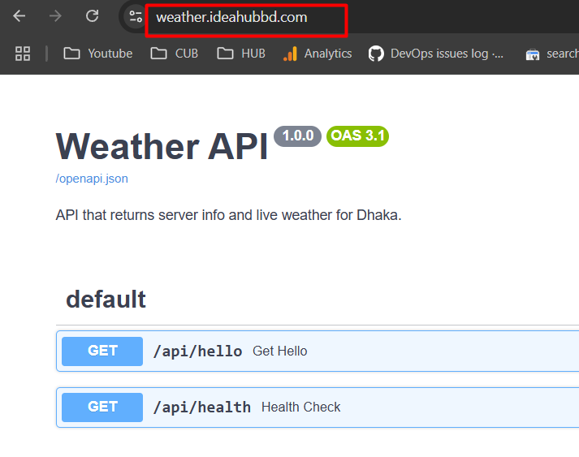
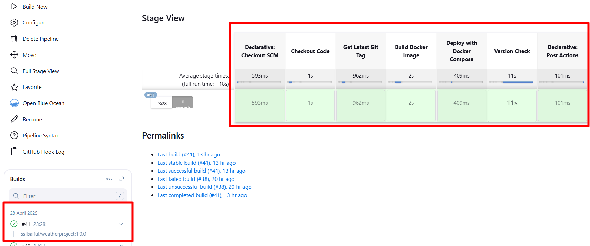
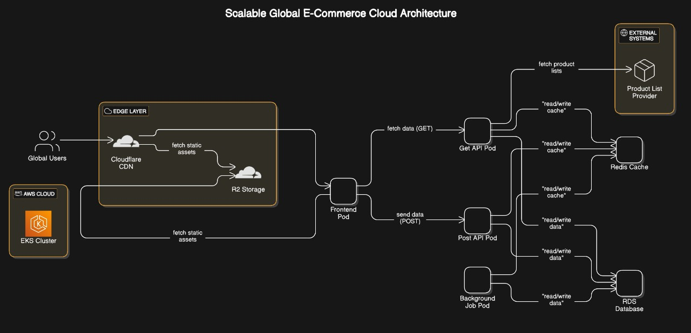

# Part A: Develop & Deploy a REST API
    I have create a project on weatherapplication using python
    python files on as named as main.py
    deployed url is = https://weather.ideahubbd.com/
    3rd party API = https://api.openweathermap.org

# 2. Containerize the Application

Create a Dockerfile for containeraization
Create docker-compose.yaml file to build and development

# 3. Version Control & CI/CD Pipeline

Create a public repository for the project repo link 
    
https://github.com/ssllsaiful/weather-fetch-api.git

# Trigger when a new release is created.

    enable github webhook and config and  GitHub hook trigger for GITScm polling enable on jenkins for auto deployment
    take relese tag as images version for maching with api responce version.
    match version with /api/hello version output.
    

# Part B: System Architecture Design
    I have tried to create a E-commarce architecture as per requrements 

   

This architecture represents a Scalable Global E-Commerce Cloud Architecture designed to handle millions of requests efficiently using Kubernetes, CDN, caching, and microservices principles. Here's a detailed explanation of each component and how scalability is achieved:

1. Global Users
Users worldwide access the e-commerce site.

Their requests are routed through a global CDN for faster delivery.

2. Cloudflare CDN (Edge Layer)
Serves static assets (JS, CSS, images) from edge locations near the users.

Reduces backend load and improves latency.

3. R2 Storage
Stores and delivers static files like media assets.

Works seamlessly with Cloudflare to serve files globally.

4. AWS EKS Cluster
Runs all application components in containers managed by Kubernetes.

Supports auto-scaling, rolling updates, and high availability.

5. Frontend Pod
Handles the UI and sends API requests to backend services.

Scales based on traffic using Kubernetes Horizontal Pod Autoscaler (HPA).

6. Get API Pod
Processes all GET requests (e.g., fetch product data).

Retrieves data from Redis or external API and scales horizontally.

7. Post API Pod
Handles all POST requests like orders or form submissions.

Writes data to Redis and RDS; scales independently of GET API.

8.Background Job Pod
Executes background tasks like email sending or scheduled jobs.

Triggered by queues or events and scales with workload volume.

9. Redis Cache
In-memory caching layer to speed up read/write operations.

Reduces pressure on databases and external APIs; scalable via clustering.

10. RDS Database
Main relational database for persistent storage (e.g., orders, users).

Uses read replicas and vertical scaling to handle millions of transactions.

11. Product List Provider (External)
Third-party service for product data.

Accessed and cached by the Get API to reduce latency and cost.

