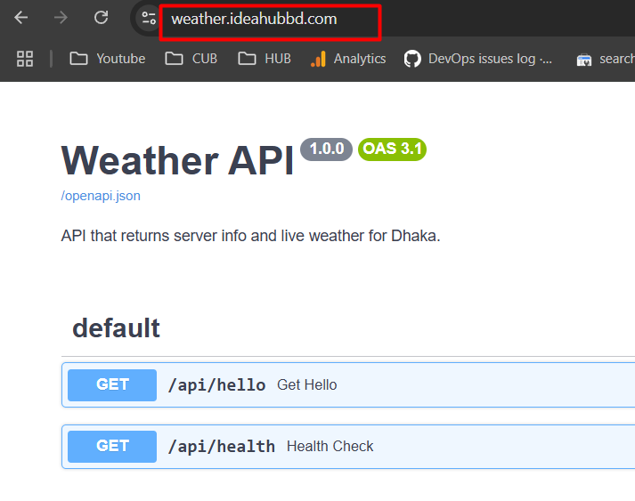

# Part A: Develop & Deploy a REST API
    I have create a project on weatherapplication using python
    python files on as named as main.py
    deployed url is = https://weather.ideahubbd.com/
    3rd party API = https://api.openweathermap.org

# 2. Containerize the Application

    Create a Dockerfile for containeraization
    Create docker-compose.yaml file to build and development

# 3. Version Control & CI/CD Pipeline

     Create a public repository for the project repo link 
    
        https://github.com/ssllsaiful/weather-fetch-api.git

Trigger when a new release is created.

    Add an event on github repo to setting for relese version automatic deployments . 
